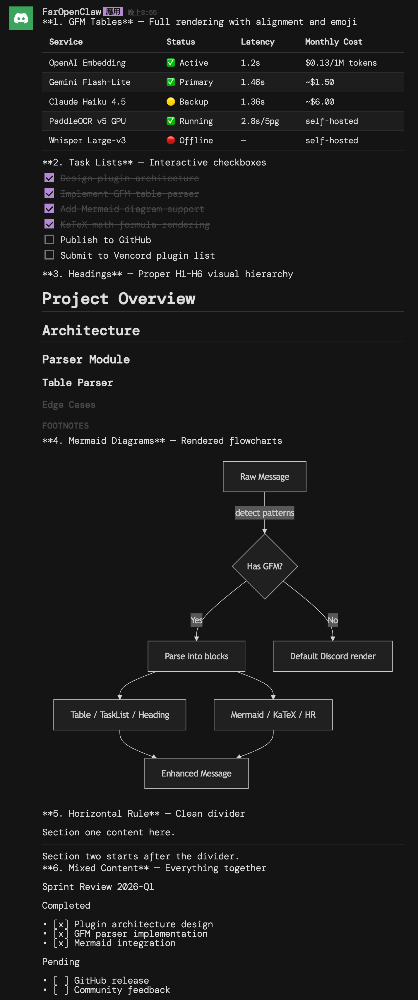
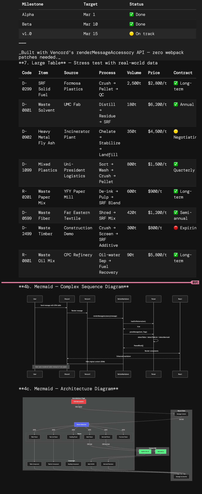
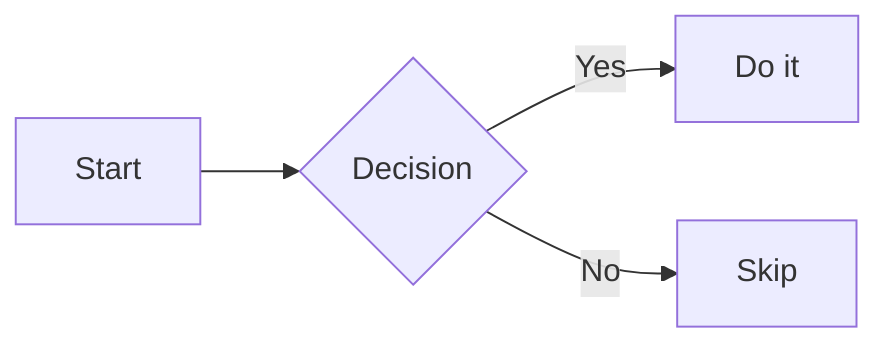

# BetterMarkdown

A [Vencord](https://vencord.dev/) userplugin that enhances Discord's markdown rendering with full GitHub Flavored Markdown (GFM) support, Mermaid diagrams, and KaTeX math formulas.

## Features

| Feature | Syntax | Description |
|---|---|---|
| **GFM Tables** | `\| h1 \| h2 \|` | Full table rendering with alignment + headerless continuation |
| **Task Lists** | `- [x] Done` | Read-only checkboxes for todo items |
| **Headings** | `# H1` – `###### H6` | Proper visual hierarchy (Discord renders all as bold) |
| **Horizontal Rules** | `---`, `***`, `___` | Styled divider lines |
| **Footnotes** | `[^1]` + `[^1]: text` | Superscript references with click-to-scroll definitions |
| **Nested Blockquotes** | `> > > text` | Depth-colored borders (blurple → green → yellow → red) |
| **Mermaid Diagrams** | `` ```mermaid `` | Flowcharts, sequence diagrams, etc. via CDN |
| **KaTeX Math** | `$E=mc^2$`, `$$...$$` | LaTeX math rendering via CDN |

## Screenshots

### Tables, Task Lists, Headings, Mermaid Flowchart, HR, Mixed Content


### Large Table (8×8), Sequence Diagram, Architecture Diagram


## How It Works

BetterMarkdown uses Vencord's `renderMessageAccessory` API to add enhanced rendering below each message, then hides the original content via DOM manipulation:

1. Checks raw message text for GFM/enhanced patterns (fast regex gate)
2. If patterns found → parses into typed blocks, renders with React components
3. Walks up the DOM to find and hide the original `[id^='message-content-']` element
4. If no patterns → does nothing (**zero overhead**)

**Code block auto-unwrapping:** Plain `` ``` `` blocks (no language tag) containing GFM patterns are automatically unwrapped and rendered. Language-tagged blocks (`` ```python ``, etc.) remain as code.

Discord's existing markdown (bold, italic, code, spoilers, mentions, emoji) is fully preserved — inline formatting within enhanced blocks uses Discord's own `simple-markdown` parser.

## Installation

### As a Vencord userplugin

1. Clone or copy the `betterMarkdown` folder into `src/userplugins/`:

```
src/userplugins/
└── betterMarkdown/
    ├── index.tsx          # Plugin definition + renderMessageAccessory
    ├── style.css          # Styles using Discord CSS custom properties
    ├── katex-loader.ts    # CDN loader for KaTeX
    ├── mermaid-loader.ts  # CDN lazy-loader for Mermaid
    ├── parser/            # Modular parsers (one per feature)
    │   ├── index.ts       # Orchestrator + fast detection
    │   ├── table.ts       # GFM tables + headerless continuation
    │   ├── taskList.ts
    │   ├── heading.ts
    │   ├── hr.ts
    │   ├── footnote.ts
    │   ├── blockquote.ts
    │   ├── math.ts        # LaTeX $...$ and $$...$$ extraction
    │   └── mermaid.ts     # ```mermaid block extraction
    └── components/        # React components
        ├── Table.tsx
        ├── TaskList.tsx
        ├── Heading.tsx
        ├── Hr.tsx
        ├── Footnote.tsx
        ├── Blockquote.tsx
        ├── Math.tsx       # KaTeX inline + block rendering
        ├── Mermaid.tsx    # Mermaid diagram rendering
        └── shared.tsx     # renderInline() via Discord's parser
```

2. Build Vencord: `pnpm build`

### For Vesktop

After building, copy the dist files into Vesktop's vencord directory:

```bash
cp dist/vencordDesktop*.js dist/vencordDesktop*.css \
   ~/Library/Application\ Support/vesktop/sessionData/vencordFiles/
```

Then restart Vesktop (Cmd+Q → reopen).

## Settings

All features can be individually toggled in **Vencord Settings → Plugins → BetterMarkdown** (no restart required):

- **Enable Tables** — GFM table rendering (default: on)
- **Enable Task Lists** — Checkbox rendering (default: on)
- **Enable Headings** — H1–H6 hierarchy (default: on)
- **Enable Horizontal Rules** — Styled `<hr>` (default: on)
- **Enable Footnotes** — Reference/definition footnotes (default: on)
- **Enable Nested Blockquotes** — Visual depth for `> >` (default: on)
- **Enable Math** — KaTeX formula rendering (default: on)
- **Enable Mermaid** — Diagram rendering (default: on)
- **Theme** — Discord Dark (default), Discord Light, or GitHub

## Syntax Examples

### Tables

```
| Name | Role | Status |
|:-----|:----:|-------:|
| Alice | Dev | Active |
| Bob | PM | Away |
```

Alignment: `:---` left, `:---:` center, `---:` right.

Headerless tables (continuation fragments from split messages) are also supported:

```
| Alice | Dev | Active |
| Bob | PM | Away |
```

### Task Lists

```
- [x] Write parser
- [x] Build components
- [ ] Test in Discord
- [ ] Ship it
```

### Mermaid Diagrams

````

````

### Math (KaTeX)

Inline: `$E = mc^2$`

Block:
```
$$
\int_0^\infty e^{-x^2} dx = \frac{\sqrt{\pi}}{2}
$$
```

### Footnotes

```
This claim needs a source[^1].

[^1]: Journal of Computer Science, 2024
```

### Nested Blockquotes

```
> Top level
> > Nested response
> > > Even deeper
```

## Technical Notes

### Architecture

```
Message ──→ renderMessageAccessory(props)
               │
               ▼
         hasGfmPatterns(text, flags)
               │
          false │ true
               │   │
     (no-op)   │   ▼
               │ parseMessage(text, flags) → ParsedBlock[]
               │   │
               │   ▼
               │ EnhancedMarkdownAccessory (React)
               │   ├── Table / TaskList / Heading / Hr
               │   ├── Footnote / Blockquote
               │   ├── Math (KaTeX CDN) / Mermaid (CDN)
               │   └── Text blocks via renderInline()
               │   │
               │   ▼
               │ useEffect: hide original message content
               │            via DOM querySelector
               │
               ▼
         Enhanced Message (or nothing)
```

### Performance

- **Detection is O(n)** on message length — simple regex tests
- **Parsing only runs** when GFM patterns are detected
- Messages without GFM syntax have zero overhead
- KaTeX is preloaded at plugin start; Mermaid is lazy-loaded on first use

### Dependencies

- **KaTeX** — loaded from jsDelivr CDN (`katex@0.16.21`)
- **Mermaid** — lazy-loaded from jsDelivr CDN (`mermaid@11`)
- No bundled heavy dependencies

### Styling

All CSS uses Discord's custom properties for native look-and-feel:
- `--background-secondary`, `--background-tertiary`
- `--text-normal`, `--text-muted`
- `--interactive-active`, `--brand-500`

Class prefix: `bm-` (e.g. `bm-table`, `bm-heading-2`)

### Limitations

- Enhanced rendering is client-side only — other users see raw markdown
- Code blocks with language tags (`` ```python ``) are protected from parsing
- Standard tables require the separator row (`|---|---|`)
- If a long table is split across Discord messages (2000 char limit), the continuation fragment renders as a headerless table
- Mermaid and KaTeX require internet access for CDN loading

### Graceful Degradation

- If a parser fails, the original content is preserved (try/catch)
- If the DOM hiding selector doesn't match, both original and enhanced content show
- If CDN loading fails, math/diagrams render as raw text

## License

MIT
